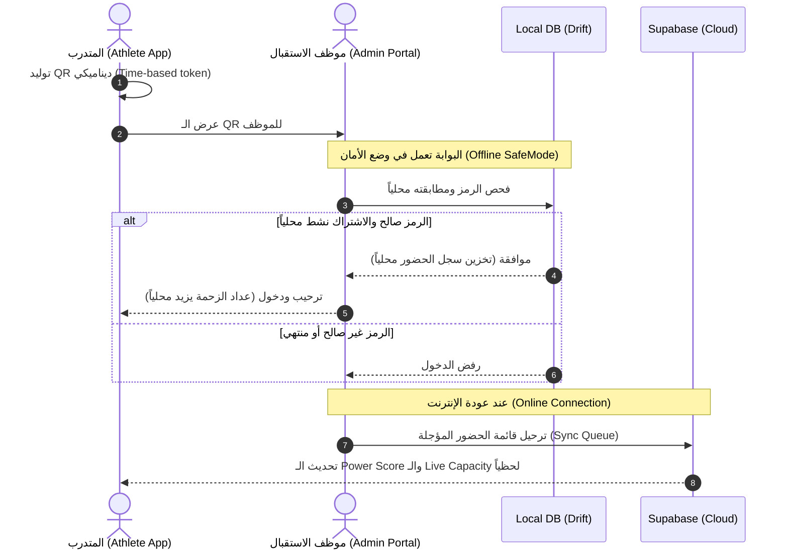

```mermaid
sequenceDiagram
    autonumber
    actor Athlete as المتدرب (Athlete App)
    actor Reception as موظف الاستقبال (Admin Portal)
    participant Drift as Local DB (Drift)
    participant Cloud as Supabase (Cloud)

    Athlete->>Athlete: توليد QR ديناميكي (Time-based token)
    Athlete->>Reception: عرض الـ QR للموظف
    Note over Reception, Drift: البوابة تعمل في وضع الأمان (Offline SafeMode)
    Reception->>Drift: فحص الرمز ومطابقته محلياً
    alt الرمز صالح والاشتراك نشط محلياً
        Drift-->>Reception: موافقة (تخزين سجل الحضور محلياً)
        Reception-->>Athlete: ترحيب ودخول (عداد الزحمة يزيد محلياً)
    else الرمز غير صالح أو منتهي
        Drift-->>Reception: رفض الدخول
    end
    Note over Reception, Cloud: عند عودة الإنترنت (Online Connection)
    Reception->>Cloud: ترحيل قائمة الحضور المؤجلة (Sync Queue)
    Cloud-->>Athlete: تحديث الـ Power Score والـ Live Capacity لحظياً
```
